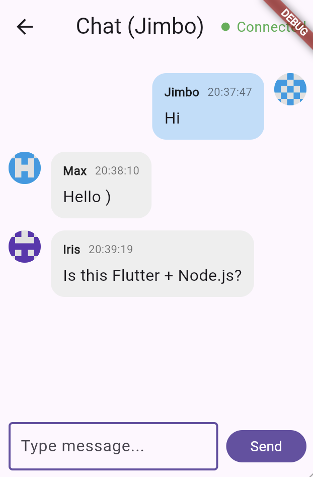

# Flutter WebSocket Chat

A minimal real-time chat app built with **Flutter** and **WebSockets**.

## Features
- Real-time messaging via WebSocket
- Username-based chat
- Message timestamp
- Connection status indicator
- Simple chat UI (bubbles + alignment)

## Tech Stack
- Flutter (Material 3)
- `web_socket_channel` for WebSocket client
- Node.js WebSocket server (for local development)

## Getting Started

### 1. Run the WebSocket server
> Make sure your server is running on port **3000**.

```bash
cd server
npm install
node index.js
```

### 2. Run the Flutter app

#### Web (recommended)
```bash
flutter run -d web-server
```
Then open the printed URL in your browser.

#### Other platforms
```bash
flutter run
```

### Configuration
WebSocket URL is defined in the Flutter code:
- **Default:** `ws://localhost:3000`

Update it if your server runs elsewhere.

## Screenshots

<p p="center">
  
  
</p>